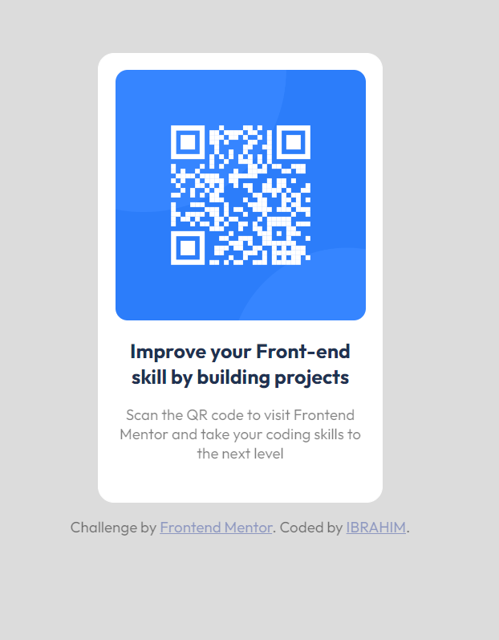

TABLE OF CONTENT

- Overview
  - Screenshot
  - Links
- My process
  - Built with
  - What I learned
  - Continued development
  - Useful resources
- Author
- Acknowledgments

## Overview

HI my name is IBRAHIM, and this is my solution to the qrcode challenge

### Screenshot
 

### LINKS
- Solution URL:(https://github.com/Dmambo/qrcode.git)
- Live site URL: (https://ibrahima.netlify.app/)

## BUILT WITH
- HTML AND CSS

## WHAT I LEARNT
I learned how to  center my work to the middle of the page/
